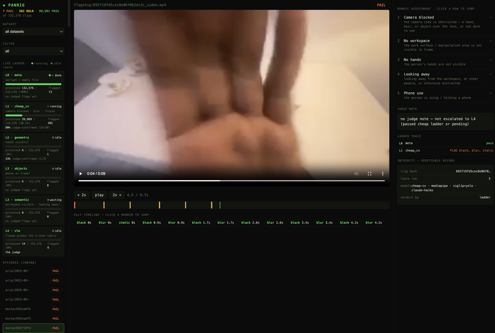

# LADDER — climb your way to cleaner data



```
  ╦  ╔═╗╔╦╗╔╦╗╔═╗╦═╗      L0 meta → L1 cv → L2 geometry → L3 semantic → L4 JUDGE
  ║  ╠═╣ ║║ ║║║╣ ╠╦╝      PASS · BORDERLINE · FAIL, graded against a capture-quality rubric
  ╩═╝╩ ╩═╩╝═╩╝╚═╝╩╚═      cheap & broad at the base, costly & precise at the top
```

A **confidence cascade** for triaging egocentric manipulation video (e.g. [EgoVerse](https://github.com/GaTech-RL2/EgoVerse))
into **PASS / BORDERLINE / FAIL**. Human headcam video is cheap to collect and mostly unusable. A bad
clip has a blocked lens, no hands in frame, the wearer looking away, or a phone in hand. Curation is the
bottleneck. Judging 100k clips with an LLM is too slow and too expensive.

So the cheap signals don't just *flag*. Each one **decides what it is confident about and defers the
rest**. Metadata, appearance, hand geometry, and scene semantics resolve the clear cases. The LLM judge
grades only the uncertain residue. It uses the same **capture-quality rubric** the cheap layers use.
Keyframes are decoded once and every layer reads the cache. Decode on a USB SSD is the bottleneck, and
the cascade pays it a single time. The run is resumable, versioned, and watchable in a live web viewer.

## The funnel, measured
This table is the output of `ladder funnel --md` on the EgoVerse preview corpus. Run it on your own
`triage.db` to reproduce the same breakdown.

On this corpus (132,576 clips):

| | clips | share |
|---|---|---|
| **decided FAIL** by a cheap layer (mostly missing hands or looking away) | 44,209 | 33.3% |
| **cleared PASS** through the cheap layers, never judged | 62,602 | 47.2% |
| **deferred to the judge** (genuinely uncertain) | 25,765 | 19.4% |

The cheap layers resolve **~80% of the corpus on their own**. The judge sees only the ~1-in-5 they
cannot call, which is **24% fewer judge calls than judging everything flagged**, before any calibration.
On the clips we judged, the cascade's confident calls agreed with the judge **84% of the time**. The
deferred band is dominated by one signal: hand visibility. Calibrating its thresholds against judge
labels (`eval.py`) is where the judge bill drops further.

Each cheap layer runs only on what the layer below cleared as GOOD, and returns **bad / good / unsure**
(two thresholds bracketing an uncertainty band). Confident-bad fails and stops. Confident-good flows
up. Unsure defers to the judge.

| Lvl | Checks | Tool | Speed | Decides |
|----|--------|------|-------|--------|
| **L0 meta** | corrupt / empty | ffprobe | ~1000/s | FAIL broken files, else pass up |
| **L1 cv** | camera blocked · blur · frozen | luma · Laplacian · motion | ~16/s | FAIL / pass / defer |
| **L2 geometry** | hands visible? | MediaPipe | ~15/s | FAIL / pass / defer |
| **L3 semantic** | workspace visible · looking away? · phone? | SigLIP + YOLO | ~1–3/s | FAIL / pass / defer |
| **L4 JUDGE** | the full rubric from keyframes (*uncertain residue only*) | Claude (`claude -p`) | ~0.1/s | **PASS/BDLN/FAIL** |

## The rubric (task-agnostic capture quality)
For any manipulation task, the rubric grades whether a clip is a usable recording at all. It does not
grade whether the task itself succeeded. Edit `rubrics/capture_quality.json`. It drives both the L3
prompts and the L4 judge:
1. **camera_blocked**: lens obstructed / too dark
2. **no_workspace**: work surface not in frame
3. **no_hands**: hands not visible
4. **looking_away**: looking away / at people / distracted
5. **phone_use**: using a phone

## Quickstart
```bash
pip install -r requirements.txt          # + `brew install s5cmd ffmpeg`
export LADDER_DATA=/path/with/space       # where the mp4s live / will download to

./ladder.py download                      # pull EgoVerse previews (resumable)
./ladder.py catalog                       # index them into triage.db
./ladder.py run                           # climb L0..L3 over everything (resumable, versioned)
./ladder.py judge --sample 200            # L4: Claude grades suspects + a clean sample
./ladder.py status                        # per-level progress + PASS/BDLN/FAIL counts
./ladder.py funnel                        # measured FAIL / cleared / deferred breakdown
./ladder.py serve                         # http://127.0.0.1:8123  (live viewer)
./ladder.py bad                           # export the silt list
```

> **Credentials:** `download` uses EgoVerse's **public** read-only keys. They are *not* committed,
> because GitHub blocks AWS keys in repos even when they are public. Grab them from the
> [EgoVerse repo](https://github.com/GaTech-RL2/EgoVerse) ("Set up your AWS keys") and provide via env:
> ```bash
> export EGOVERSE_AWS_KEY=...   EGOVERSE_AWS_SECRET=...
> ```
> (or drop them in a gitignored `egoverse_creds.py`). If downloads 403, the keys rotated. Refresh them from their repo.

## The viewer (`ladder serve`)
- **Live ladder**: each level's progress, rate, ETA, and judge-confirm rate (which levels are trustworthy).
- **Episode list**: every clip with a PASS/BDLN/FAIL badge.
- **Per clip**: video plus a **silt timeline** (click a marker to jump to the exact second), the
  **rubric assessment** (5 items PASS/FAIL), the **judge note** (scene-aware), the **ladder trace**,
  and an integrity record.

## How it stays fast & honest
- **Decode once**: keyframes are cached (`frames_cache/`) and every level reuses them, so re-tuning a
  detector never re-hits disk. Decode on a USB SSD is the bottleneck. The models are cheap by comparison.
- **One source of truth**: everything lands in `triage.db` (SQLite). It is resumable (skips done) and
  **versioned** (tune a detector and new rows are written while old rows stay), so you can measure
  whether a change improved.
- **The judge calibrates the layers**: cheap layers decide what they are confident about and defer the
  rest. `ladder eval` scores each layer's confident calls against the judge, so you can see where a
  layer is reliable and tighten its uncertainty band for fewer deferrals at the same accuracy.

## Config
- `LADDER_DATA`: data root for videos, `triage.db`, and caches. Default `~/ladder-data`.
- Detector thresholds and the ladder (levels, triggers, versions) live in `panlib.py` (`STAGES`).
- The judge model is `claude -p`. Swap it in `panlib.py:_vlm`.

## Layout
```
ladder.py        CLI entry (climb your way to cleaner data)
panlib.py        store + keyframe cache + the ladder (STAGES) + rubric loader + judge
pan.py           orchestrator: catalog / run / judge / verdict / status / funnel / bad
serve.py         the web viewer (SQLite -> SPA, presigned-ready)
eval.py          score levels vs the judge; compare versions
download.py      EgoVerse downloader (uses the public creds)
rubrics/         capture_quality.json (+ optional task rubrics)
```
